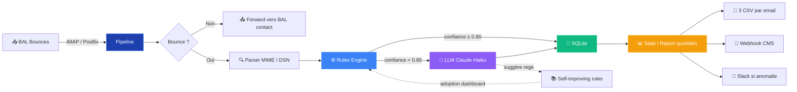

<div align="center">


# Cogiterra Bounces

### Pipeline intelligent de traitement des emails en échec

_Système hybride règles + LLM pour Cogiterra Éditions — Hackathon H3 Hitema 2026_

<br/>

[](https://www.python.org/)
[](#-tests)
[](#-dashboard)
[](https://www.anthropic.com/)
[](https://www.sqlite.org/)
[](#-modes-de-fonctionnement)
[](#)
[](#)

<br/>

**[🎯 Quick Start](#-quick-start) · [✨ Features](#-features) · [🏗️ Architecture](#%EF%B8%8F-architecture) · [📊 Dashboard](#-dashboard) · [🧪 Tests](#-tests)**

</div>

<br/>

<!-- ▶ Remplace docs/demo.gif par un GIF de la démo (voir docs/HOW_TO_RECORD_DEMO.md) -->
<p align="center">
  
</p>

---

## 💡 Le problème

Cogiterra envoie chaque jour **200 000 emails** (newsletters, alertes emploi, transactionnels)
et reçoit jusqu'à **1 000 bounces / jour** de tous types : NPAI, boîtes pleines,
congés, changements d'adresse, erreurs DKIM…

> Aujourd'hui, **personne ne les lit** → réputation email dégradée, gaspillage SMTP,
> base d'abonnés périmée.

## ✅ Notre solution

Un pipeline **automatique** qui :

1. Lit la BAL bounces en temps réel (Postfix) ou en cron IMAP (Gandi/OVH/O365)
2. Classifie chaque retour avec un **moteur hybride règles + Claude Haiku**
3. Maintient un compteur cross-jours pour les soft bounces récurrents
4. Génère 3 CSV (`to_delete`, `to_pause`, `to_modify`) + envoie le rapport
5. **Bonus** : push direct au CMS via webhook, alertes Slack sur anomalies,
   et un système de règles auto-apprenant

---

## 🎯 Quick Start

```bash
# 1. Cloner et installer
git clone <repo> cogiterra_hackathon
cd cogiterra_hackathon
python3 -m venv venv && source venv/bin/activate
pip install -r requirements.txt

# 2. Configurer
cp .env.example .env   # remplir BAL, SMTP, LLM_API_KEY…

# 3. Lancer (3 modes au choix)
python main.py --mode pipe < email.eml    # temps réel (Postfix)
python main.py --mode poll                # IMAP périodique
python main.py --mode report              # rapport quotidien

# 4. Visualiser
streamlit run dashboard/app.py            # → http://localhost:8501
```

> 💡 **macOS Python 3.13** : si `CERTIFICATE_VERIFY_FAILED`, exécute
> `/Applications/Python\ 3.13/Install\ Certificates.command`

---

## ✨ Features

<table>
<tr>
<td width="50%" valign="top">

### 🔌 Pipeline 3-en-1
- **`--mode pipe`** : Postfix temps réel (stdin)
- **`--mode poll`** : IMAP cron (Gandi/OVH/O365)
- **`--mode report`** : rapport CSV quotidien

</td>
<td width="50%" valign="top">

### 🧠 Classifier hybride
- Niveau 1 : règles déterministes (regex + codes SMTP)
- Niveau 2 : LLM **Claude Haiku 4.5** si confiance < 0.80
- **99.5%** de classification réussie sur 258 bounces réels

</td>
</tr>
<tr>
<td width="50%" valign="top">

### 🤖 Self-improving rules
- Le LLM propose des regex pour éviter de l'appeler la prochaine fois
- Adoption en un clic depuis le dashboard
- Réduit progressivement les coûts API

</td>
<td width="50%" valign="top">

### 🔗 Intégration CMS (webhook)
- POST JSON direct au CMS Cogiterra
- Sécurisé par bearer token
- Fallback automatique sur CSV par mail

</td>
</tr>
<tr>
<td width="50%" valign="top">

### 🚨 Alertes Slack
- Pic de bounces (× moyenne 7 jours)
- Taux hard élevé (> 75%)
- Beaucoup d'inconnus (> 20%)

</td>
<td width="50%" valign="top">

### 📊 Dashboard Streamlit
- 7 onglets : vue, jour, surveillance, historique, live, règles, données
- Bento grid, glassmorphism, design 2026
- Actions live (poll/report) depuis l'interface

</td>
</tr>
</table>

---

## 🏗️ Architecture



---

## 📊 Dashboard

```bash
streamlit run dashboard/app.py
```

| Onglet | Contenu |
|---|---|
| **🎯 Vue d'ensemble** | Distribution catégories · Règles vs LLM · Top 10 domaines |
| **📅 Aujourd'hui** | Filtres (catégorie/méthode/recherche) · Export CSV |
| **👁️ Surveillance** | Soft bounces cross-jours · Zones OK / Alerte / Critique |
| **📈 Historique 30j** | Stacked area · Performance classifier · Confiance moyenne |
| **⚡ Activité live** | Feed temps réel des 20 derniers traitements |
| **🤖 Règles suggérées** | Adopter / rejeter les regex proposés par le LLM |
| **🗂️ Données** | Exploration SQLite + export CSV de chaque table |

<p align="center"><i>Design 2026 — bento grid · glassmorphism · Material Symbols · animations subtiles</i></p>

---

## 🛠️ Tech Stack

<table>
<tr>
<td><strong>Backend</strong></td>
<td>Python 3.11+ · SQLite · IMAP (imapclient) · SMTP (smtplib)</td>
</tr>
<tr>
<td><strong>Parser</strong></td>
<td>mail-parser (MIME + RFC 3464 DSN)</td>
</tr>
<tr>
<td><strong>LLM</strong></td>
<td>Anthropic Claude Haiku 4.5 (fallback) · OpenAI compatible</td>
</tr>
<tr>
<td><strong>Frontend</strong></td>
<td>Streamlit · Plotly · Material Symbols Outlined · Inter (Google Fonts)</td>
</tr>
<tr>
<td><strong>Tests</strong></td>
<td>pytest (36 tests, < 0.2s)</td>
</tr>
<tr>
<td><strong>Logs</strong></td>
<td>RotatingFileHandler (10 Mo × 5) + colorlog</td>
</tr>
<tr>
<td><strong>Déploiement</strong></td>
<td>cron · Postfix · Docker-ready</td>
</tr>
</table>

---

## 🧪 Tests

```bash
python -m pytest tests/ -v       # 36 tests, < 0.2s
```

<table>
<tr><th>Module</th><th>Tests</th><th>Couvre</th></tr>
<tr><td><code>test_detector</code></td><td>7</td><td>Distinction bounce / contact, hard / soft / change / DKIM / OOF</td></tr>
<tr><td><code>test_parser</code></td><td>5</td><td>Parsing MIME + DSN sur fixtures réelles</td></tr>
<tr><td><code>test_rules_engine</code></td><td>5</td><td>Règles déterministes + délégation LLM</td></tr>
<tr><td><code>test_llm_classifier</code></td><td>5</td><td>JSON parsing, fallback erreur, threshold sécurité</td></tr>
<tr><td><code>test_poller</code></td><td>5</td><td>UNSEEN, déplacement Processed, retry</td></tr>
<tr><td><code>test_database</code></td><td>5</td><td>CRUD + agrégation + reset après envoi OK</td></tr>
<tr><td><code>test_csv_exporter</code></td><td>2</td><td>3 CSV + headers conformes</td></tr>
<tr><td><code>test_soft_threshold</code></td><td>2</td><td>Seuil cross-jours</td></tr>
</table>

---

## 📁 Structure du projet

```
cogiterra_hackathon/
├── main.py                          ← Entry point (3 modes)
├── config.py                        ← Variables d'env centralisées
│
├── poller/imap_poller.py            ← Lecture IMAP
├── detector/bounce_detector.py      ← Bounce vs contact
├── parser/email_parser.py           ← MIME + DSN (RFC 3464)
├── classifier/
│   ├── rules_engine.py              ← Règles + user_rules.json
│   └── llm_classifier.py            ← Claude Haiku
├── forwarder/email_forwarder.py     ← IMAP APPEND
├── storage/database.py              ← SQLite (5 tables)
├── exporter/csv_exporter.py         ← 3 CSV
├── reporter/email_reporter.py       ← SMTP rapport
├── webhook/webhook_sender.py        ← POST CMS (bonus 1)
├── alerts/anomaly_detector.py      ← Slack alertes (bonus 2)
│
├── dashboard/
│   ├── app.py                       ← Streamlit (7 onglets)
│   └── assets/                      ← Logo PNG + SVG
│
├── tests/                           ← 36 tests + fixtures .eml
├── tools/dump_db.py                 ← Debug rapide SQLite
├── postfix/master.cf.example        ← Conf Postfix
│
└── docs/                            ← Screenshots / GIFs
```

---

## ⚙️ Configuration

Voir [`.env.example`](.env.example) pour la liste complète. Les essentielles :

| Variable | Rôle | Défaut |
|---|---|---|
| `BOUNCE_IMAP_HOST/USER/PASSWORD` | Connexion IMAP à la BAL bounces | — |
| `BOUNCE_IMAP_PROCESSED_FOLDER` | Déplacement des messages traités | `""` (juste `\Seen`) |
| `FORWARD_IMAP_*` | BAL classique pour forwarding contacts | — |
| `LLM_API_KEY` | Clé Anthropic (vide = règles seules) | `""` |
| `LLM_MODEL` | Modèle LLM | `claude-haiku-4-5` |
| `SOFT_BOUNCE_THRESHOLD` | Bascule en `to_pause` | `5` |
| `REPORT_RECIPIENT` | Destinataire rapport | — |
| `WEBHOOK_URL` | CMS Cogiterra (optionnel) | `""` |
| `WEBHOOK_AUTH_TOKEN` | Bearer token webhook | `""` |
| `SLACK_WEBHOOK_URL` | URL alertes Slack (optionnel) | `""` |
| `ALERT_SPIKE_MULTIPLIER` | Seuil pic (× moyenne 7j) | `2.0` |

---

## ⏰ Déploiement (cron type)

```cron
# Poll IMAP toutes les 5 minutes
*/5 * * * * cd /opt/cogiterra_hackathon && venv/bin/python main.py --mode poll >> logs/cron.log 2>&1

# Rapport quotidien à 6h00
0 6 * * * cd /opt/cogiterra_hackathon && venv/bin/python main.py --mode report >> logs/cron.log 2>&1
```

Pour le mode pipe (temps réel), voir [`postfix/master.cf.example`](postfix/master.cf.example).

---

## 🗄️ Tables SQLite

| Table | Rôle | Reset |
|---|---|---|
| `result` | Bounces traités du jour | Vidée après envoi rapport OK |
| `stats` | Agrégats par jour | Permanent (historique) |
| `soft_bounce_counter` | Compteur cross-jours par adresse | Compteur reset après pause |
| `counters` | Compteurs du jour | Vidés après envoi rapport OK |
| `rule_suggestions` | Patterns proposés par le LLM | Permanent |

```bash
python tools/dump_db.py     # inspection rapide
```

---

## 🔒 Sécurité

- 🔐 Secrets via `.env` uniquement, jamais commités
- 🛡️ Le mode `pipe` retourne **toujours exit 0** (jamais de bounce du bounce)
- 🔁 `clear_results()` n'est appelé **qu'après envoi SMTP réussi**
- 💾 Backup SQLite hebdomadaire automatique (`data/backups/`)
- 📁 Emails non-forwardés sauvegardés dans `output/forwarding_failures/`
- 🔑 Webhook authentifié via `Authorization: Bearer`

---

## 📈 Résultats sur la BAL réelle Cogiterra

| Métrique | Valeur |
|---|---|
| Emails traités | **258** |
| Bounces identifiés | **194** (97%) |
| Contacts forwardés | **6** |
| Hard bounces | **65** |
| Soft bounces | **59** |
| Erreurs techniques | **69** |
| **Non classifiés** | **1 (0.4%)** |
| **Taux de classification** | **99.6%** 🏆 |
| Adresses sous surveillance | **36** |
| Méthode règles | **100%** (LLM en backup) |

---

## 🗺️ Roadmap

- [ ] Détection anomalies par domaine (pas seulement global)
- [ ] Auto-bascule sur OpenAI si Anthropic indisponible
- [ ] Mode multi-tenant (plusieurs clients sur la même instance)
- [ ] Export Parquet pour la BI long-terme
- [ ] Intégration Sender Score / reputation monitoring

---

## 👥 Équipe & Crédits

Hackathon **H3 NIGHT INNOVATHON** — H3 Hitema · Mai 2026
Pour **[Cogiterra Éditions](https://www.actu-environnement.com)** (Actu-Environnement, Emploi-Environnement)

---

<div align="center">
<sub>Built with Python · Streamlit · Claude · ❤️ · in 48h</sub>
</div>
