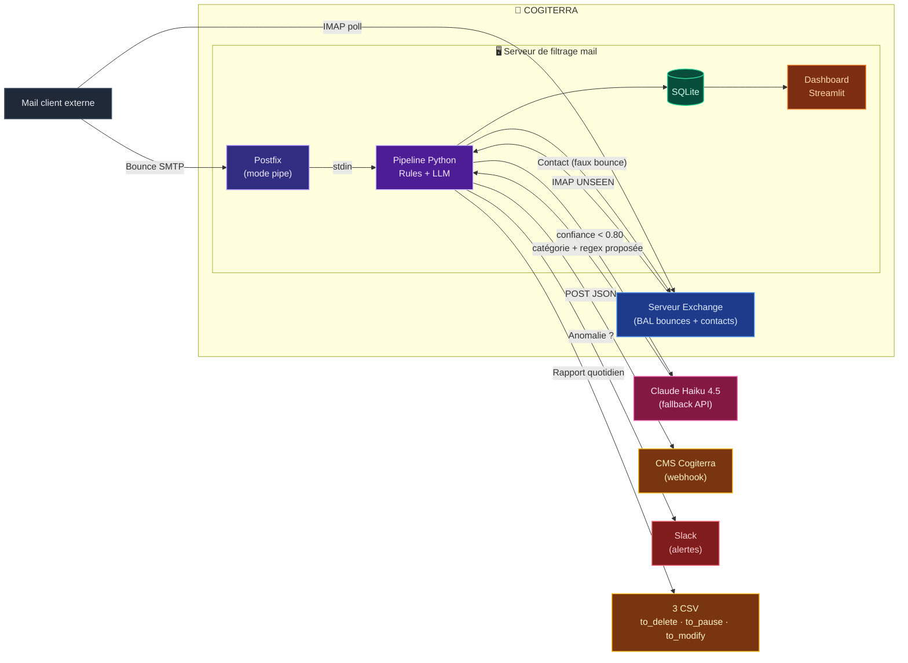
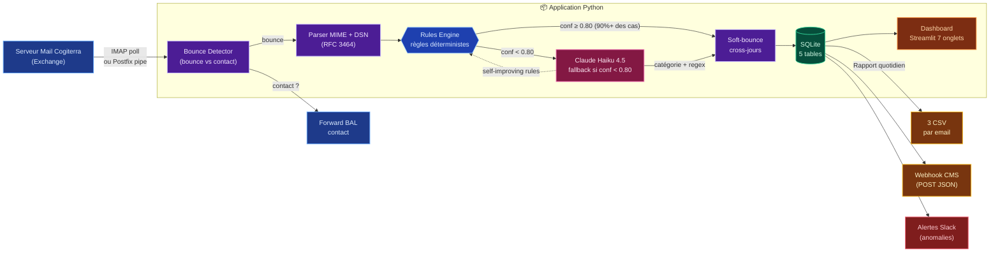
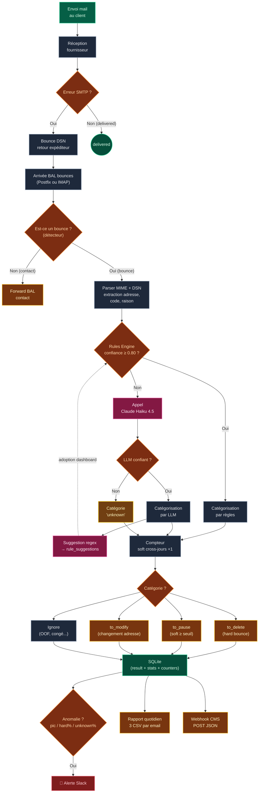

# 📐 Schémas Mermaid — version conforme au projet

Trois schémas corrigés et adaptés à l'état réel du projet **Cogiterra Bounces**.

> 🎯 **Comment les utiliser dans `index.html`**
>
> 1. Inclure Mermaid une seule fois dans le `<head>` :
>    ```html
>    <script type="module">
>      import mermaid from 'https://cdn.jsdelivr.net/npm/mermaid@10/dist/mermaid.esm.min.mjs';
>      mermaid.initialize({ startOnLoad: true, theme: 'dark' });
>    </script>
>    ```
> 2. Coller chaque bloc dans une slide :
>    ```html
>    <div class="mermaid">
>      ...code Mermaid ci-dessous...
>    </div>
>    ```
>
> Ou bien : intégrer directement la page `schemas.html` en iframe.

---

## 🔧 Différences avec les schémas d'origine

| Élément manquant / faux dans l'original | Corrigé dans cette version |
|---|---|
| ❌ LLM Claude Haiku absent | ✅ Ajouté comme fallback (uniquement si confiance < 0.80) |
| ❌ SQLite absente | ✅ Stockage central matérialisé |
| ❌ Dashboard Streamlit absent | ✅ Connecté à SQLite |
| ❌ Webhook CMS absent | ✅ Sortie séparée |
| ❌ Alertes Slack absentes | ✅ Branche dédiée |
| ❌ Détecteur bounce/contact absent | ✅ Premier filtre avant parsing |
| ❌ Compteur soft cross-jours absent | ✅ Étape dédiée |
| ❌ Self-improving rules absent | ✅ Flèche pointillée LLM → Rules |
| ⚠️ Ordre logique inversé (boîte bounce après filtrage) | ✅ Flux corrigé : bounce **arrive** dans la BAL **puis** est filtré |
| ⚠️ Catégorie « unknown » absente | ✅ Branche `LLM pas confiant → unknown` |

---

## 📊 Schéma 1 — Architecture globale Cogiterra

> Vue infra : où s'insère notre serveur de filtrage entre le mail client, Postfix et Exchange.



---

## 🧩 Schéma 2 — Application interne (pipeline détaillé)

> Vue rapprochée des étages du pipeline Python, avec branchement Rules vs LLM.



---

## 🌳 Schéma 3 — Flowchart logique complet

> Tous les chemins de décision : du mail envoyé au CSV final.



---

## 🛠️ Intégration rapide dans `index.html`

### Option A — En iframe (ultra simple)
```html
<iframe src="schemas.html"
        style="width:100%;height:100vh;border:0;border-radius:16px"></iframe>
```

### Option B — Copier/coller un bloc Mermaid
Dans le `<head>` (une seule fois) :
```html
<script type="module">
  import mermaid from 'https://cdn.jsdelivr.net/npm/mermaid@10/dist/mermaid.esm.min.mjs';
  mermaid.initialize({ startOnLoad: true, theme: 'dark' });
</script>
```

Dans une slide :
```html
<section class="slide">
  <h2>Architecture</h2>
  <div class="mermaid">
    flowchart LR
      ...
  </div>
</section>
```

---

<sub>Cogiterra Bounces — H3 NIGHT INNOVATHON 2026</sub>
